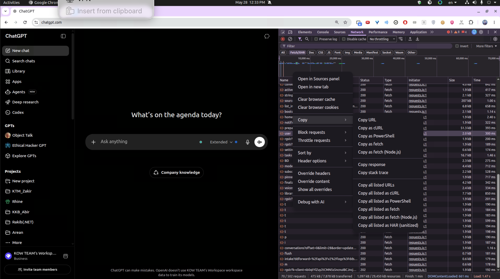
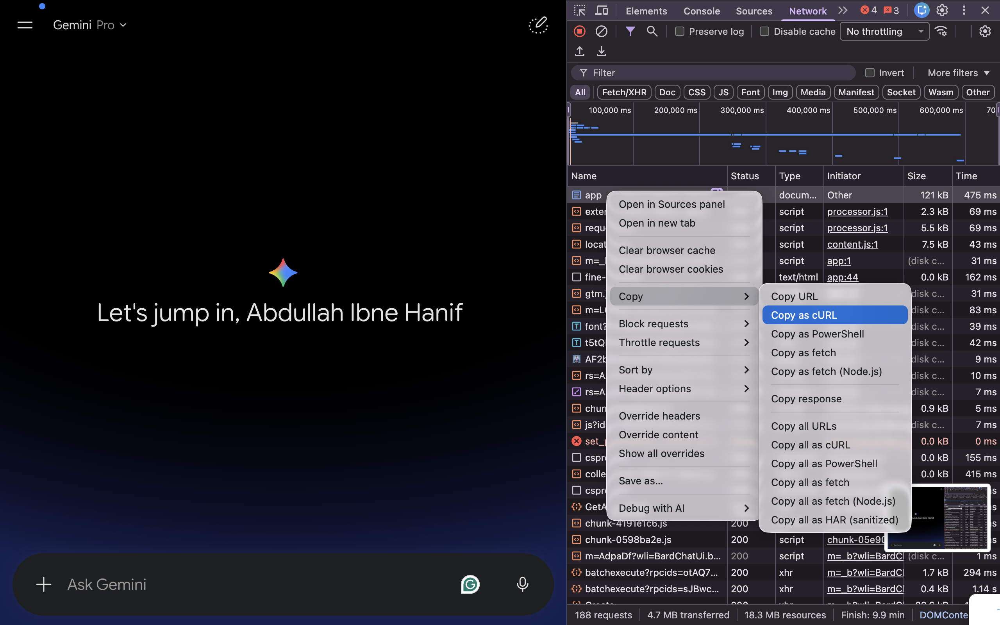

# How to Get Cookies

Web2API uses browser session cookies to talk to Perplexity, ChatGPT, and Gemini through their web interfaces.

Maintained by **[Abdullah Ibne Hanif Arean](https://abdullaharean.com)** — AI Researcher (NLP & 3D Computer Vision), Junior AI Researcher at [The KOW Company](https://thekowcompany.com).

## General workflow

1. Log in to the provider website in your browser.
2. Open DevTools (`F12` or `Ctrl + Shift + I` on Windows/Linux, `Cmd + Option + I` on Mac).
3. Go to the **Network** tab.
4. Refresh the page.
5. Right-click the first request, hover **Copy**, and choose **Copy as cURL (bash)**.
6. Paste the cURL command into [curlconverter.com/python](https://curlconverter.com/python/).
7. Copy the extracted `cookies` dict (and headers where noted below).
8. Save them into the matching file under [`auth/`](../auth/).

Copy the example templates first:

```bash
cp auth/cookies.local.json.example auth/cookies.local.json
cp auth/chatgpt.local.json.example auth/chatgpt.local.json
cp auth/gemini.local.json.example auth/gemini.local.json
```

Then replace placeholder values with your real session data.

**Important:** Never commit `*.local.json` files. Session cookies expire and should be treated as secrets.

---

## Perplexity

**File:** `auth/cookies.local.json`

**Format:** flat JSON object `{ "cookie_name": "value", ... }`

### Steps

1. Open [perplexity.ai](https://perplexity.ai/) and log in.
2. Open DevTools → **Network**.
3. Refresh the page.
4. Right-click the first request → **Copy** → **Copy as cURL (bash)**.
5. Paste into [curlconverter.com/python](https://curlconverter.com/python/).
6. Copy the `cookies` dictionary into `auth/cookies.local.json`.

### Critical cookies

- `__Secure-next-auth.session-token`
- `next-auth.csrf-token`
- `cf_clearance`

### Environment variable alternative

```bash
export PERPLEXITY_COOKIES='{"__Secure-next-auth.session-token":"..."}'
```

If no cookies are configured, Perplexity runs in anonymous mode (limited to auto mode).

---

## ChatGPT

**File:** `auth/chatgpt.local.json`

**Format:** nested JSON with `cookies`, `headers`, and `account_id`

### Steps

1. Open [chatgpt.com](https://chatgpt.com/) and log in.
2. Open DevTools (`F12` or `Ctrl + Shift + I` on Windows/Linux, `Cmd + Option + I` on Mac).
3. Go to the **Network** tab and filter by **Fetch/XHR**.
4. Refresh the page or send a message until you see a request to `https://chatgpt.com/backend-api/` (for example `user`, `me`, or `conversation`).
5. Right-click that request, hover **Copy**, and click **Copy as cURL (bash)**.



6. Open [curlconverter.com/python](https://curlconverter.com/python/) and paste the cURL command.
7. From the generated Python code, copy:
   - the `cookies = { ... }` dictionary
   - the `headers = { ... }` dictionary (especially `authorization`, `chatgpt-account-id`, `x-oai-is`, `oai-device-id`, and `oai-session-id`)
8. Build `auth/chatgpt.local.json`:

```json
{
  "cookies": { "...": "..." },
  "headers": {
    "authorization": "Bearer ...",
    "chatgpt-account-id": "...",
    "x-oai-is": "...",
    "oai-device-id": "...",
    "oai-session-id": "...",
    "user-agent": "..."
  },
  "account_id": "same-as-chatgpt-account-id"
}
```

### curlconverter tip

On [curlconverter.com/python](https://curlconverter.com/python/), paste the copied cURL and use the **Python + Requests** output. Map the generated `cookies` and `headers` into `chatgpt.local.json`. Set `account_id` to the same value as `headers.chatgpt-account-id`.

### Required fields

- `cookies` — full cookie jar, including split session tokens:
  - `__Secure-next-auth.session-token.0`
  - `__Secure-next-auth.session-token.1`
- `headers.authorization` — `Bearer <access_token>`
- `headers.chatgpt-account-id`
- top-level `account_id`

### Environment variable alternative

```bash
export CHATGPT_AUTH='{"cookies":{...},"headers":{...},"account_id":"..."}'
```

---

## Gemini

**File:** `auth/gemini.local.json`

**Format:** nested JSON with `cookies`, optional `headers`, optional `build_label`

### Steps

1. Open [gemini.google.com/app](https://gemini.google.com/app) and log in with your Google account.
2. Open DevTools (`F12` or `Ctrl + Shift + I` on Windows/Linux, `Cmd + Option + I` on Mac).
3. Go to the **Network** tab.
4. Refresh the page or send a message in Gemini.
5. In the request list, find a request to `gemini.google.com` (for example `app`, `batchexecute`, or `StreamGenerate`).
6. Right-click that request, hover **Copy**, and click **Copy as cURL (bash)**.



7. Open [curlconverter.com/python](https://curlconverter.com/python/) and paste the cURL command.
8. Copy the generated `cookies` dictionary from the Python output.
9. Save the cookies into `auth/gemini.local.json`:

```json
{
  "cookies": {
    "__Secure-1PSID": "...",
    "__Secure-1PSIDTS": "...",
    "__Secure-3PSID": "...",
    "COMPASS": "..."
  },
  "headers": {}
}
```

### curlconverter tip

On [curlconverter.com/python](https://curlconverter.com/python/), you only need the `cookies = { ... }` block from the converted Python code. Paste that into the `cookies` field of `gemini.local.json` and keep `headers` as `{}` unless you need overrides.

### Required cookies

- `__Secure-1PSID` (required)
- Recommended: `__Secure-1PSIDTS`, `__Secure-3PSID`, `COMPASS`, `NID`, `SIDCC`

### Optional fields

- `build_label` — auto-fetched from the Gemini init page if omitted
- `headers` — override default browser headers if needed

### Environment variable alternative

```bash
export GEMINI_AUTH='{"cookies":{"__Secure-1PSID":"..."}}'
```

---

## Auth directory override

By default, Web2API reads auth files from the `auth/` folder in the project root. Override with:

```bash
export WEB2API_AUTH_DIR=/path/to/your/auth/folder
```

---

## Troubleshooting

| Symptom | Likely cause |
|---------|--------------|
| HTTP 401 / 403 | Expired session cookies — re-export from browser |
| Cloudflare block on Perplexity | Missing or stale `cf_clearance` cookie |
| ChatGPT sentinel error | Stale Bearer token or missing proof-of-work headers |
| Gemini "Could not extract SNlM0e" | Google session expired — refresh cookies |
| Works locally but not on server | Cookies may be IP-bound — re-export while logged in from server region |

Rotate cookies immediately if you accidentally expose them in chat, logs, or a public repository.

